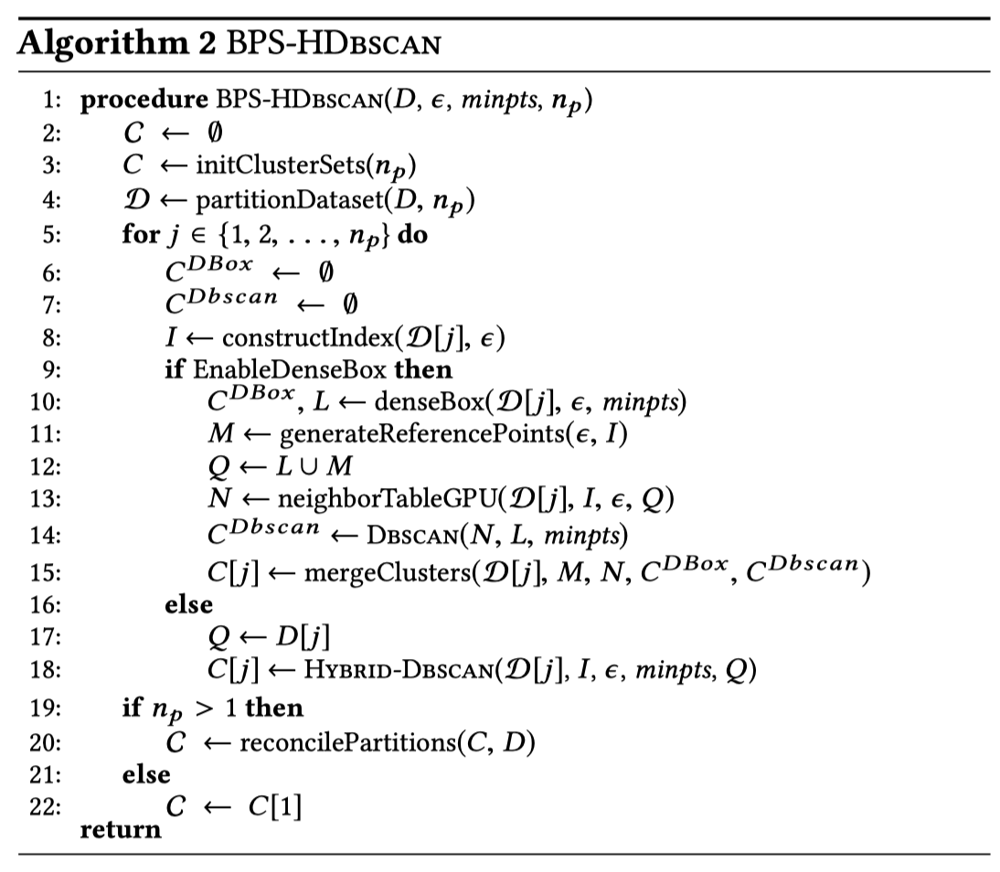

# Multicore-DBSCAN
Hybrid CPU/GPU DBSCAN algorithm. Homework of multicore course, SYSU.


### Working on...

added a simple code framework

```bash
cd Code
mkdir build && cd build
cmake ..
make
```

- Change .vscode/c_cpp_properties.json to highlight properly in ur environment.
- Implement cuda functions in lib/xxx.cu and declare them in include/xxx.cuh.


### Schedule

- 6月29日（19周周一）：书面报告
  - 无论现场报告时间安排，统一提交书面报告
- 6月29日（19周课上）：现场报告
  - 要求所有同学到场


### DBSCAN clustering algorithm

#### Original DBSCAN

Param: $\epsilon$, $minpts$

- core point
- border point
- noise

#### Key advances of original DBSCAN

- Dense Box Algorithm
  - Modified kd-tree  $\rightarrow$  generate dense boxes
  - avoid all distance calculations within dense box
- Disjoint Set Data Structure
  - multiple processes, each cluster their own local points $\rightarrow$ merge into final cluster
- Hybird CPU/GPU Algorithm
  - GPU: the $\epsilon$-neighborhood of each point
  - CPU: modified DBSCAN algorithm


### HYBRID-DBSCAN

limited to smaller dataset

- Indexing Scheme: grid-based, for GPU
  - points may be in $\epsilon$-neighborhood $\rightarrow$ in adjacent cells
  - only index non-empty grid cells
- Batching Scheme
  - Enable: total result set size > GPU's global memory capacity 


### BPS-HDBSCAN: a shared-memory GPU/GPU approach

Based on HYBRID-DBSCAN, combined key advances of original DBSCAN.

#### Pillar-1: distance calculation avoidance in dense data regions

Proposed an approach that **dynamically enables or disables DenseBox as a function of the data distribution and Dbscan parameters**, such that DenseBox does not degrade performance.

Basic merge operations:

​	4.1 Merging Adjacent Dense Boxes

​	4.2 Merging Non-Adjacent Dense Boxes

​	4.3 Merging Dense Boxes & DBSCAN Clusters

Detect merge:

​	4.4 Detection of Dense Box Merges

Implement: disjoint sets

​	4.5 Merging using Disjoint Sets

dynamically enables or disables DenseBox:

​	4.6 Selectively Using the Dense Box Algorithm

#### Pillar-2: efficient merging of subclusters

#### Pillar-3: obviating limited GPU memory capacity by both batching the result set and partitioning the input dataset

#### Pillar-4: computing data partitions in parallel

#### Algorithm




