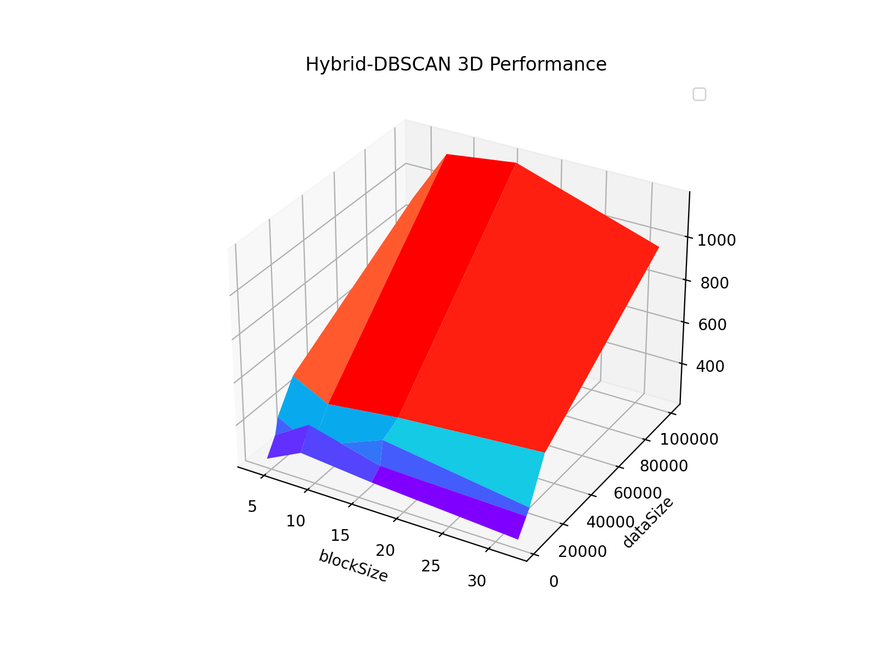

# 多核程序设计与实践-书面报告


## 1. 选题介绍：DBSCAN聚类算法


DBSCAN(Density-Based Spatial Clustering of Applications with Noise)是一基于密度的聚类算法，能够把具有足够高密度的区域划分为簇，并可在噪声的空间数据库中发现任意形状的聚类，在许多领域（如天文学等）均被广泛应用。

下图展示了DBSCAN的示例分类结果，其分辨非线形聚类的能力是K-means等其他聚类算法所不能达到的：


### 1.1 算法原理

在二维空间中，设数据集为$D$, 数据集中的任意点$p \in D$的$\epsilon$邻域为：以$p$为圆心，半径为$\epsilon$的圆。

根据数据点可分为以下三类：
1. 核心点：$p$的$\epsilon$邻域内点数超过$MinPts$，则$p$是核心点，且$p$的$\epsilon$邻域内的所有点都由$p$直接可达。
2. （密度）可达点：如果存在一条道路$p_1, ..., p_n$，其中$p_1 = p， p_n = q$，每一个点$p_{i}$到$p_{i + 1}$都是直接可达，则$q$是$p$的（密度）可达点。
3. 噪音点：不是核心点也不是可达点的数据点都属于噪音。

DBSCAN的基本思想是：若$p$可达$q$，则$p、q$属于同一个聚类。


上图中，红色点为核心点，黄色点为红色点的可达点，因此红色、黄色点同属于一个聚类。蓝色点不是核心点或可达点，属于噪音点。

基于上述算法原理，我们将DBSCAN的算法流程伪代码简化如下：

```python
function DBSCAN(D, eps, MinPts):
   for 点p in 数据集D:
      if 点p已经被访问过:
         continue
      将点p标注为访问过
      p_neighbors := 点p的eps邻域内所有点
      if 点p不是核心点:
         将点p标注为噪音点
      else:
         标注点p属于新集群c
         for 点q in p_neighbors:
            if 点q还没有被访问过:
                将点q标注为访问过
                q_neighbors := 点q的eps邻域内所有点
                if 点q是核心点:
                        p_neighbors := p_neighbors join q_neighbors
            if 点q不属于任何聚类:
                标注点q也属于集群c
```


### 1.2 复杂度分析

在DBSCAN中，时间复杂度主要取决于$\epsilon$邻域的查询次数。每个点$p$都要查询并遍历一遍$\epsilon$邻域，则最坏的时间复杂度是$O(|D|^2)$，空间复杂度为$O(|D|)$。


### 1.3 并行化意义

DBSCAN的并行化优化有两方面的重要意义：
1. **优化时间复杂度**：在实际使用场景中，$O(|D|^2)$的时间复杂度在大部分情况下都是不可承受的；通过并行化可以优化时间复杂度，增加DBSCAN的实用性。
2. **处理大数据集**：DBSCAN在聚类过程中需要将整个数据集加载到内存中并存储中间结果，无法处理较大的数据集；我们可以将数据集划分为大小合适的分块，并行化地对每个分块进行局部聚类，最后合并聚类得到最终聚类，从而处理大数据集。


## 2. 优化目标

分析可知，朴素实现的DBSCAN算法有以下局限性：
1. DBSCAN算法中需要对数据集中所有点进行$\epsilon$邻域搜索，涉及大量耗时的距离计算；
2. DBSCAN算法为串行算法，没有完全利用CPU或GPU的处理能力；
3. DBSCAN算法需要将整个数据集加载到内存中并存储中间结果，由于内存限制，无法处理较大的数据集。

我们的优化目标是追寻Michael Gowanlock等人自2017至2019年发表的三篇论文，结合CUDA和OpenMP两个并行计算框架，实现多核CPU和GPU共享存储的优化DBSCAN聚类算法，突破朴素DBSCAN算法的局限性。


### 2.1 Hybrid-DBSCAN

Michael Gowanlock等人在2017年发表的论文*Clustering Throughput Optimization on the GPU*、2018年发表的论文*A Hybrid Approach for Optimizing Parallel Clustering Throughput using the GPU*中提出了Hybrid-DBSCAN算法。

Hybrid-DBSCAN相比于朴素实现的DBSCAN，主要改进如下：
1. 使用网格状的索引(index)，以减少$\epsilon$邻域计算中耗时的距离计算;
2. 基于网格索引，使用CUDA并行化$D$中各点的$\epsilon$邻域计算，构建出各点的邻居表；
3. 设计批处理方案，增量式地调用CUDA计算数据集各点的$\epsilon$邻域，各批次之间使用OpenMP并行处理。批处理方案有以下优点：
    - 能处理超出显存限制的结果集（可达关系的集合）；
    - 使用多个CUDA stream分别处理各批次，并行化GPU计算和GPU-Host之间的数据传输（某个stream在进行计算的同时，另一个stream可以利用空闲的带宽进行数据传输）。


### 2.2 BPS-DBSCAN

Michael Gowanlock等人在2019年发表的论文*Hybrid CPU/GPU Clustering in Shared Memory on the Billion Point Scale*中提出了BPS-DBSCAN算法。

BPS-DBSCAN是基于Hybrid-DBSCAN的改进版。在Hybrid-DBSCAN的基础上，BPS-DBSCAN进行了以下更进一步的改进：
1. 提出了DenseBox算法，大幅减少$\epsilon$邻域计算中耗时的距离计算（DenseBox算法的具体细节在3.2.2小节给出）;
2. 对数据集进行分块处理，使用OpenMP并行化各数据块的局部聚类，再合并各局部聚类。
    - 此分块处理大大增加了可处理的数据集的量级，能处理超过GPU显存限制的数据集及中间结果，论文显示该方法可处理百万级别的数据集。


## 3. 实际优化内容

我们基本实现了论文所提出的Hybrid-DBSCAN和BPS-DBSCAN算法。囿于时间和设备限制，我们没有进行多GPU计算，或实现论文中提出的其他改进方案。

以下是我们所实现的优化内容：


### 3.1. Hybrid-DBSCAN

#### 3.1.1. 网格索引(index)

为了减少在查找$\epsilon$邻域时的距离计算，我们以$\epsilon$为边长，将数据空间划分为若干个网格，设每个网格的编号为`cellID`，数据点$p \in D$散落在各网格中，如下图所示。



可见，空网格没有存储价值，假设数据点$p$落在某个网格$c$中，则在$p$的$\epsilon$邻域的数据点必然只可能在与$c$相邻的9个网格中的非空网格中。因此，我们根据网格编号`cellID`的大小顺序，给所有非空网格一个新编号`gridID`。

为了计算邻域，我们还需要快速查询每个非空网格中的所有数据点。因此，我们按照数据点所在的非空网格的`gridID`的大小顺序，给每个数据点一个新的有序编号`orderedID`，使得在同一个非空网格中的所有数据点的`orderedID`是连续的一段。这样，我们就可以通过记录该非空网格中最小的`orderedID`和最大的`orderedID`来定位所有落在该网格中的数据点。


实现于`DBSCAN::constructIndex`。

#### 3.1.2. CUDA并行化$\epsilon$邻域计算并创建邻居表

由于数据点的邻域计算没有依赖关系，我们让每个线程计算一个数据点的$\epsilon$邻域。虽然使用CUDA并行化计算$\epsilon$邻域的好处是明显的，但也带来了数据传输的问题。如果把每个线程计算完的邻域都直接传输回host内存，带来的开销会很大：
- 由于不能提前知道每个数据点的邻域有多大，只能给每个线程分配$|D|$（邻域最多$|D|$个点）的空间，所有线程则需要$|D|^2$的数据传输；
- GPU数据传输到host的带宽被争抢。

因此，对于每个CUDA stream，我们在GPU的全局内存中申请一块缓冲区，把各数据点的可达关系resultSet存储在该缓冲区中。resultSet里存储的是若干个key-value对，表示`orderedID` = key的邻域中有`orderedID` = value的数据点。

kernel函数的伪代码如下：
```python
procedure kernel(D, index, eps): // D是分批后的数据集
    计算出thread的globalID
    通过globalID和数据所在批次，计算出数据点p的orderedID
    if orderedID >= |D|:
        return
    
    通过orderID找出数据所在的网格的gridID
    通过gridID找出该网格的相邻网格grids
    for each grid in grids:
        for each point q in grid:
            if dist(p, q) <= eps:
                # 注意：由于resultSet放在全局内存中，因此这一步是原子操作
                resultSet := resultSet join (p, q) 
```

由于各线程并发地读写resultSet，因此resultSet中key相同的键值对并不一定相邻。而构造邻居表的时候，我们需要的获取某个key的所有邻居，因此我们调用thrust库的sort-by-key函数，在GPU的全局内存中对resultSet进行排序，使得key相同的键值对相邻。

实现于`DBSCAN::constructGPUResultSet`。

#### 3.1.3. 批处理

如前所述，为了：
- 能处理超出显存限制的resultSet
- 使GPU计算和GPU-Host之间的数据传输同步进行

我们对数据集进行批处理，通过简单的将`orderedID`分段，创建$n_b$个批次，使用OpenMP并行地计算每个批次的数据集的resultSet。

我们在GPU上创建了3个CUDA stream，将某一批次的计算任务分配给其中一个stream。每个stream都有对应一块全局内存缓冲区以存放resultSet；当一个stream在进行计算的同时，另一个stream可以利用空闲的带宽进行数据传输。

#### 3.1.4. 创建邻居表


由于resultSet在全局内存的缓冲区中，我们在它被刷新以前（即下一批次到来以前）把它传输到host内存（使用thrust库的device_ptr来完成此操作），根据resultSet创建邻居表。由于resultSet已经是有序的，key相同的键值对必然相邻，所以数据点的邻居表只需要存储其对应key在resultSet中的起始下标和终止下标即可。

实现于`DBSCAN::constructNeighborTable`。

#### 3.1.5. 使用邻居表的修改版DBSCAN

我们已经提前计算得邻居表，因此我们需要修改DBSCAN使其使用邻居表。此步骤比较简单，不在此赘述。

实现于`DBSCAN::DBSCANwithNeighborTable`。

#### 3.1.6. Hybrid-DBSCAN算法伪代码

```
procedure Hybrid-DBSCAN(D, eps, MinPts):
    index := constructIndex(D, eps)
    初始化neighborTables
    按照orderedID将数据集D分为N个batch
    
    #pragma omp parallel for
    for each batch b:
        resultSet := constructGPUResultSet(b)
        sortByKey(resultSet) # 在显存上进行，使用thrust库
        neighborTables.join(constructNeighborTable(resultSet))
    
    DBSCANwithNeighborTable(neighborTables) # 修改版DBSCAN
```


### 3.2. BPS-DBSCAN

#### 3.2.1. 数据分块(Partition)

当数据集相当巨大的时候，普通聚类算法不能保证内存和显存可以容纳完整的数据集。因此，我们实现了一个数据分块的功能。它可以把完整数据集分割成多块独立聚类，再在聚类结束之后把各个分块合并。具体方法为在数据集第一维上进行分割，并使得每一块包含的数据点大致相同，如下图所示(红线)：


另外，如果内存显存允许，不同的数据块聚类过程可以并行执行，达到加速的效果。事实上，这种分块思想并不局限于DBSCAN聚类算法，它甚至可以推广到任意聚类算法上。数据的分块合并过程可以记为如下几个步骤。

1. 计算分割边界

    为了让每一块分块里的数据大致相同，我们首先需要在数据集第一维上以$\epsilon$为步长分割成许多个Cells，然后统计每一个Cell里面的数据点数。接着我们就能确认那些Cell之间为分割边界，使得每两个边界之间数据点的数量都大致为$\frac{数据总量}{分割块数}$。将分割边界记录下来。
    
2. 数据分块

    有了分割边界，我们就可以将数据分割。由于分割边界已知，分割不同数据块直接没有了依赖，所以这个过程我们可以利用openmp并行执行。分割同时，我们需要记录分割后的数据在子块里的下标和分割前数据在总块里的下标之间的映射，这样最后才能将子块合并。除此之外，我们还需要将边界附近Cells的点记录下来，称之为shadowCells。用于之后不同块之间聚类簇的合并。同样的，我们也需要一份shadowCells下标的映射表。
    
3. 子块独立聚类

    对每一个子块独立聚类就好了。这个过程也可以利用openmp并行执行。
    
4. 聚类结果合并

    当子块聚类完成后，我们需要将它们的聚类结果合并。对于不同子块聚类算法返回的聚类簇，我们只需要考虑上面提到的shadowCells里面的点就可以了。一个shadowCells的例子如下：
    
    
    在这里面进行一次聚类，在聚类过程中判断是否出现了不同子块的点被聚类成同一类。若出现了这种情况，则标记这两类为同一类。最后，利用上面记录的下标映射表，我们将修正之后的聚类簇重写到一个完整的聚类簇上，实现完整的聚类。

#### 3.2.2. DenseBox算法

DenseBox算法被用来消除距离过近的点之间的距离计算过程，我们以$\frac{\epsilon}{2\sqrt{2}}$的距离划分网格，并记录每个点属于哪一个网格，如果一个网格中的点的数量超过minpts，就认为这是一个非空的网格，否则就将这些点记录下来，使用带有邻居表的DBSCAN算法对这些点单独聚类，最后合并所有的网格，合并的过程可以记为以下$5$个步骤:

1. 分离稀疏点

   首先遍历所有点，将每个点放入其对应的网格内，然后计算每个网格中存在的点的数目，如果一个网格中存在超过minpts个点，就认为这个网格非空，并且标记网格中的所有点属于同一个类，否则将这个网格中的所有点加入集合$L$。所有非空网格聚类的结果记为$C^{DBox}$
   
2. 对$L$集聚类

   对于集合$L$中的点，首先使用GPU加速建立邻居表，然后使用邻居表加速DBSCAN对$L$聚类，记聚类的结果为$C^{DBSCAN}$。

3. 合并相邻网格

   显然，在以$\frac{\epsilon}{2\sqrt{2}}$为间隔分割出的网格中，相邻两个网格中的点之间的距离一定小于$\epsilon$，如下图所示。
   
   
   
   所以我们可以遍历一遍非空的网格，将所有两两相临的网格中的点合并为一类。
   
4. 合并不相邻网格

   对于不相邻的网格，可能存在下图的两种情况：

   

   - 对于(a)中所示情况，两个蓝色格子中任意两点之间的距离都大于$\epsilon$，所以两个格子不能合并。
   - 但对于(b)中所示情况，左侧红色格子靠右边的点显然和右边红色格子靠左边的点之间的距离小于$\epsilon$，所以这两个格子中的点应当被合并为一类。


5. 合并DenseBox结果和DBSCAN结果

   经过(3)(4)两个步骤后，DenseBox中的类别数目会减少很多，而且在我们的实际测试中也确实如此，在经过步骤(3)后，$C^{DBox}$中的类别数目从113减少到了26，再经过了步骤(4)之后，$C^{DBox}$中的类别数目又从26减少到了17。

   接下来的工作就是将两个集合$C^{DBox}$和$C^{DBSCAN}$合并起来，对此，论文中提出了一个叫做Reference Point的概念，如下图所示。Reference Point位于每个非空的网格中间，用来记录以该点为圆心，$1.5\epsilon$为半径范围内的所有点的索引。

   

   利用Reference Point，我们可以认为位于同一个Reference Point记录内的所有点都属于同一个类别，根据此将$C^{DBox}$和$C^{DBSCAN}$合并到一起。

   在实际测试中，我们的DenseBox算法经过步骤(5)后将聚类的数目从17减少到了10，在去除所有噪音点以后成功获得了2个聚类，基本符合正常DBSCAN的聚类结果。

#### 3.2.3. BPS-DBSCAN算法伪代码

```
procedure BPS-DBSCAN(D, eps, MinPts, N_p):
    初始化总聚类簇 C
    初始化N_p个子聚类簇 Cs
    计算边界Bs
    Ds, shadowCells := Partition(D, Bs, N_p)
    #pragma omp parallel for
    for D' in Ds:
        if denseBox:
            subC = DenseBox(D', eps, MinPts)
        else:
            subC = Hybrid-DBSCAN(D', eps, MinPts)
        
        #pragma omp critical    //修改外部变量需要避免访问冲突
        Cs[i] = subC
    
    C = merge(Cs, shadowCells)
```


## 4. 具体实验方案

代码结构（参见Code文件夹）如下：
```bash
.
├── .clang-format # 代码格式化
├── data # 数据集
│   ├── input # 测试数据集
│   └── output # 输出结果集
├── .gitignore
├── include # 三种DBSCAN方法及辅助函数的声明
│   ├── BPSDBSCAN.hpp
│   ├── Dataset.hpp
│   ├── DBSCAN.hpp
│   ├── DenseBox.hpp
│   ├── global.hpp
│   ├── HybridDBSCAN.hpp
│   ├── OriginalDBSCAN.hpp
│   ├── Shadower.cuh
│   └── utils.hpp
├── lib # 三种DBSCAN方法及辅助函数的具体实现
│   ├── BPSDBSCAN.cpp
│   ├── Dataset.cpp
│   ├── DBSCAN.cu
│   ├── DenseBox.cpp
│   ├── HybridDBSCAN.cu
│   ├── OriginalDBSCAN.cpp
│   ├── Shadower.cu
│   └── utils.cpp
├── makefile 
└── src # 主函数
    └── main.cpp
```

运行方式：
```bash
make clean
make # 生成target文件夹和obj文件夹
make all # 生成所有obj文件和可执行文件
./target/multicoreDBSCAN <Dataset file>, <Epsilon>, <MinPts>, <Partitions>, <BlockSize>
```


### 4.1. 辅助函数

#### 4.1.1. 数据集的载入及处理

我们将数据集封装成类`Dataset`, 封装了数据集的一系列操作：
```c++
class Dataset {
public:
    // 将txt数据集转换成二进制数据集，用于压缩大数据集
    int genDatasetFromTxt(const std::string fromTxt, const std::string toBin);
    // 数据集的读入
    void loadDataset(const std::string file);
    // 数据集的显示
    void showDataset(int head = 100);
    // Get Funtions
    const DataPointsType& getDataset();
    
private:
    // ... 省略
};
```

声明于`include/dataset.hpp`，实现于`lib/dataset.cpp`。

#### 4.1.2. 父类DBSCAN

由于我们将实现三种不同的DBSCAN算法：
- 朴素实现的DBSCAN（Original-DBSCAN）
- Hybrid-DBSCAN
- BPS-DBSCAN

我们将以上三种算法均封装成类，继承自父类DBSCAN。父类DBSCAN起到规范接口、让三种算法共用父类方法的作用。

由于构造索引index、构造结果集resultSet、构造邻居表、实现使用邻居表的DBSCAN是Hybrid-DBSCAN和BPS-DBSCAN都会调用的方法，故将其实现为父类DBSCAN的方法（参数较长，在此报告中省略，详情请见代码）。

```c++
class DBSCAN {
public:
    /** 定义纯虚函数，作为接口 **/
    // 算法运行
    virtual void run() = 0;
    // 输出结果到指定文件
    virtual void print(const string &outFile) = 0;
    
protected:
    // 遍历数据集，将数据空间划分成以eps为边长的网格
    void calcCells(/** 参数较长，省略 **/);
    // 创建网格索引
    void constructIndex(/** 参数较长，省略 **/);
    // 调用核函数，计算resultSet
    float constructGPUResultSet(/** 参数较长，省略 **/);
    // 根据resultSet建立邻居表
    void constructNeighborTable(/** 参数较长，省略 **/);
    // 修改后的使用邻居表的DBSCAN
    void DBSCANwithNeighborTable(/** 参数较长，省略 **/);
};
```

其中，关键的操作是构建resultSet和根据resultSet建立邻居表，在Hybrid-DBSCAN中由于批处理的需要实现了这两个方法合为一体并加上批处理的方法，因此在此不再赘述实现细节。

声明于`include/DBSCAN.hpp`，实现于`lib/DBSCAN.cpp`。


### 4.2. Original-DBSCAN

作为基线，我们实现了朴素实现DBSCAN算法。

关键代码如下：
```c++
void OriginalDBSCAN::run() {
    // ... 省略
    int clusterID = 0;
    for (uint i = 0; i < dataSize; i++) {
        // 如果数据点已经被访问过，说明已经被聚类或者是噪音点
        if (clusterIDs[i] == DBSCAN::UNVISITED) {
            // 暴力求邻域（遍历所有数据点）
            auto neighbors = getNeighbors(i);
            if ((neighbors.size() + 1) < minpts) {
                // 噪音点
                clusterIDs[i] = DBSCAN::NOISE;
            } else {
                // 核心点
                clusterIDs[i] = ++clusterID;
                // 遍历可达点
                for (uint j = 0; j < neighbors.size(); j++) {
                    uint p = neighbors[j];
                    if (clusterIDs[p] == DBSCAN::UNVISITED) {
                        auto pNeighbors = getNeighbors(p);
                        if ((pNeighbors.size() + 1) >= minpts) {
                            // p也是核心点，则可达点增多
                            neighbors.insert(neighbors.end(), pNeighbors.begin(), pNeighbors.end());
                        }
                    }
                    // 如果点p尚未被聚类，已知p可达，故同属一个聚类
                    if (clusterIDs[p] == DBSCAN::UNVISITED || clusterIDs[p] == DBSCAN::NOISE) {
                        clusterIDs[p] = clusterID;
                    }
                }
            }
        }
    }
    // ... 省略
```

声明于`include/OriginalDBSCAN.hpp`，实现于`lib/OriginalDBSCAN.cpp`。


### 4.3. Hybrid-DBSCAN

构造索引index、构造结果集resultSet、构造邻居表、实现使用邻居表的DBSCAN等操作已抽出并实现于父类DBSCAN。

为了实现Hybrid-DBSCAN的批处理，我们将构造结果集resultSet、构造邻居表这两个方法合并为新方法`constructResultSetAndNeighborTable`，这也是Hybrid中最关键的操作（为了实现方便，同样将其放在父类中，代价是调用时参数较多）。

```c++
void DBSCAN::constructResultSetAndNeighborTable(const uint &NCHUNKS, /* 批处理批数 */ const array<uint, 2> &nCells, /* 数据空间中各维度的网格数 */ const uint &gridSize, /* 非空网格数 */ const vector<uint> &ordered2GridID, /* orderedID对应的数据点所在的非空网格ID的转换表 */ const vector<uint> &ordered2DataID, /* orderedID到DataID的转换表 */ const vector<uint> &grid2CellID, /* 非空网格ID到cellID的转换表 */ const vector<Grid> &index, /* 索引 */ const uint &blockSize, /* 其他参数省略 */) {
    uint chunkSize = dataSize / NCHUNKS;
    /** 
    将数据集dataPoints、ordered2DataID、
    orderedID2GridID、grid2CellID、index
    从内存拷贝到GPU的全局存储
    **/
    float *d_dataPoints;
    uint *d_ordered2DataID, *d_ordered2GridID, *d_grid2CellID;
    Grid *d_index;
    // 拷贝过程省略...
    /**
    为每个CUDA Stream都申请一块全局内存空间，用于缓存resultSet。
    resultSet由若干对键值对组成，key和value均是数据点的orderedID
    **/
    uint *d_orderedIDKeys[GPU_STREAMS];
    uint *d_orderedIDValues[GPU_STREAMS];
    for (uint i = 0; i < GPU_STREAMS; i++) {
        CHECK(cudaMalloc((void **)&d_orderedIDKeys[i], sizeof(uint) * GPU_BUFFER_SIZE));
        CHECK(cudaMalloc((void **)&d_orderedIDValues[i], sizeof(uint) * GPU_BUFFER_SIZE));
    }
    /**
    为每一个Stream创建一个计数器cnt，
    用于记录该Stream存储的resultSet中的键值对数量
    **/
    uint *d_cnt;
    CHECK(cudaMalloc((void **)&d_cnt, sizeof(uint) * GPU_STREAMS));
    // 创建CUDA Stream
    cudaStream_t stream[GPU_STREAMS];
    for (uint i = 0; i < GPU_STREAMS; i++) {
        CHECK(cudaStreamCreateWithFlags(&stream[i], cudaStreamNonBlocking));
    }

    /*** 批处理并行计算resultSet（CPU开启GPU_STREAMS个线程） ***/
#pragma omp parallel for schedule(dynamic, 1) num_threads(GPU_STREAMS)
    for (uint i = 0; i < NCHUNKS; i++) {
        // 将每个批次分配给对应的stream
        uint chunkID = i;
        int streamID = omp_get_thread_num();
        // 清空当前子resultSet计数
        neighborsCnts[streamID] = 0;
        CHECK(cudaMemcpyAsync(&d_cnt[streamID], &neighborsCnts[streamID], sizeof(uint), cudaMemcpyHostToDevice, stream[streamID]));
        // 使用一维模型，调用核函数
        dim3 dimGrid(ceil((double)chunkSize / (double)blockSize));
        dim3 dimBlock(blockSize);
        gpuCalcGlobal<<<dimGrid, dimBlock, 0, stream[streamID]>>>(chunkID, NCHUNKS, chunkSize, dataSize, nCells[1], gridSize, epsilonPow, d_dataPoints, d_ordered2DataID, d_ordered2GridID, d_grid2CellID, d_index, &d_cnt[chunkID], d_orderedIDKeys[streamID], d_orderedIDValues[streamID]);
        // 将计数结果从显存拷贝回内存
        CHECK(cudaMemcpyAsync(&neighborsCnts[streamID], &d_cnt[streamID], sizeof(uint), cudaMemcpyDeviceToHost, stream[streamID]));
        /** 
        利用thrust库，在显存中对resultSet的键值对按照key进行排序，
        使得key相同的键值对相邻
        **/
        device_ptr<uint> d_keyPtr(d_orderedIDKeys[streamID]);
        device_ptr<uint> d_valuePtr(d_orderedIDValues[streamID]);
        try {
            sort_by_key(thrust::cuda::par.on(stream[streamID]), d_keyPtr, d_keyPtr + neighborsCnts[streamID], d_valuePtr);
        } catch (std::bad_alloc &e) {
            fprintf(stderr, "Error: bad alloc when sorting.\n");
            exit(-1);
        }
        // 排序完成后，将resultSet拷贝回内存
        CHECK(cudaMemcpyAsync(raw_pointer_cast(orderedIDKeys[streamID]), raw_pointer_cast(d_keyPtr), sizeof(uint) * neighborsCnts[streamID], cudaMemcpyDeviceToHost, stream[streamID]));
        CHECK(cudaMemcpyAsync(raw_pointer_cast(orderedIDValues[streamID]), raw_pointer_cast(d_valuePtr), sizeof(uint) * neighborsCnts[streamID], cudaMemcpyDeviceToHost, stream[streamID]));
        // stream同步
        CHECK(cudaStreamSynchronize(stream[streamID]));
        // 利用刚计算得的resultSet构造邻居表
        valuePtrs[chunkID] = new uint[neighborsCnts[streamID]];
        constructNeighborTable(orderedIDKeys[streamID], orderedIDValues[streamID], neighborsCnts[streamID], valuePtrs[chunkID], neighborTables);
    }

    // 释放显存空间 （省略）
    // 销毁 CUDA Stream
    for (int i = 0; i < GPU_STREAMS; i++) {
        CHECK(cudaStreamDestroy(stream[i]));
    }
}
```

其中，核函数`gpuCalcGlobal`的作用是让每个线程计算一个点的邻域。
核函数的实现中需要注意的是，由于resultSet存储在全局内存中，为了避免数据竞争，添加键值对到resultSet时必须采用原子操作。

```c++
__global__ void gpuCalcGlobal(const uint chunkID, /* 批处理的批次 */ const uint NCHUNKS,  /* 批处理批数 */ const uint dataSize, /* 数据集大小 */ const uint nCells1, /* 用于计算cellID */ const uint gridSize, /* 非空网格数 */ const float epsilonPow, /* eps^2 */ const float *d_dataPoints, /* 数据集 */ const uint *d_ordered2DataID, /* orderedID到dataID的转换表 */const uint *d_ordered2GridID, /* orderedID所在的非空网格ID的查询表 */ const uint *d_grid2CellID, /* 非空网格对应的cellID的查询表 */ const Grid *d_index, /* 索引 */ uint *d_cnt, /* 计数 */ uint *d_orderedIDKey, /* resultSet键 */ uint *d_orderedIDValue // resultSet值
) {
    uint globalID = blockIdx.x * blockDim.x + threadIdx.x;
    if (globalID >= chunkSize) return;

    // 计算orderedID，需要看分块
    uint orderedID = globalID * NCHUNKS + chunkID;
    // 获取orderedID对应的数据点所在的非空网格编号
    uint gridID = d_ordered2GridID[orderedID];
    uint cellID = d_grid2CellID[gridID];
    uint newCellID = 0;
    // 查找相邻的非空网格
    for (int i = -1; i <= 1; i++) {
        for (int j = -1; j <= 1; j++) {
            // 获取该相邻网格的gridID 过程省略
            // 如果该非空网格存在
            if (gridID < gridSize) {
                // 遍历网格中每一个数据点
                for (uint k = d_index[gridID].orderedID_min; k <= d_index[gridID].orderedID_max; k++) {
                    // 排除自己 过程省略
                    // 如果距离小于eps，是可达点
                    if (gpuInEpsilon(orderedID, k, epsilonPow, dataSize, d_dataPoints, d_ordered2DataID)) {
                        // 原子操作，防止数据竞争
                        uint idx = atomicAdd(d_cnt, int(1));
                        d_orderedIDKey[idx] = orderedID;
                        d_orderedIDValue[idx] = k;
                    }
                }
            }
        }
    }
}
```

### 4.4. BPS-DBSCAN

BPS-DBSCAN相比于父类多了`partition`、`modifiedDBSCAN`和`merge`操作。

`modifiedDBSCAN`的操作较为简单，即循环将子块数据点交给DenseBox 或 Hybrid-DBSCAN 处理。这个过程可以用openmp并行执行。

```c++
void BPSDBSCAN::modifiedDBSCAN() {
    bool enableDenseBox = true;

#pragma omp parallel for num_threads(NUM_THREADS) shared(clusterIDsArray, partDataPointsArray) schedule(dynamic, 1)
    for (uint partID = 0; partID < NCHUNKS; partID++) {
        // ... 省略

		    // 分析是否使用densebox(作用不大)
        double meanPointsHeuristic = partDataSize / (8.0 * partnNonEmptyCells);
        if (meanPointsHeuristic < ((1.0 * minpts) * 0.25)) {
            enableDenseBox = false;
        }

        if (enableDenseBox) {
            auto denseBox = DenseBox(epsilon, minpts, partDataPoints);
            denseBox.test();
            partClusterIDs = denseBox.getCluster();
        } else {
            auto hybrid_dbscan = HybridDBSCAN(epsilon, minpts, partDataPoints, partDataPoints[0].size(), blockSize, NCHUNKS);
            hybrid_dbscan.run();
            partClusterIDs.resize(hybrid_dbscan.clusterIDs.size());
            partClusterIDs = hybrid_dbscan.clusterIDs;
        }
		
        //需要避免冲突访问clusterIDsArray
        #pragma omp critical
        {
            clusterIDsArray[partID] = partClusterIDs;
        }
    }
}
```


#### 4.4.1. 数据分块与合并

其中`partition`里包含了数据分块的三个函数，分别是`generateGridDimensions`、`generatePartitions`和

首先是一个统计Cells个数和范围的函数，并按此生成分割数据的边界

```c++
void generatePartitions(
    const DataPointsType &dataPoints,//数据集
    //其他参数
    vector<uint> &binBounaries,//记录边界是在哪个Cells上
    const int &NCHUNKS) {
    //find binBounaries of cells

    unsigned long int *bins = new unsigned long int[nCells[0]];//用于记录每个Cell里有多少个数据点
    double *cumulativeFrac = new double[nCells[0]];//用于记录前k个Cell里的数据点占百分之多少

    //统计过程省略

    double fractionDataPerPartition = 1.0 / (NCHUNKS * 1.0);//计算每个分块里面占多少百分比的数据点
    double boundary = fractionDataPerPartition;

    // calu binBounaries of cells
    binBounaries[0] = 0;
    unsigned int cntBin = 1;
    for (unsigned long int i = 0; i < nCells[0] - 1; i++) {
        //若累计的点足够多了，则记录一个边界
        if (boundary >= cumulativeFrac[i] && boundary < cumulativeFrac[i + 1]) {
            binBounaries[cntBin] = i;
            cntBin++;
            boundary += fractionDataPerPartition;
        }
    }
    binBounaries[NCHUNKS] = nCells[0];
}
```

最后是将数据分块，并记录shadowCells

```c++
void generatePartitionDatasets(
    //其他参数
    vector<DataPointsType> &partDataPointsArray,//分割之后多组小数据集
    vector<PointChunkLookup> &pointChunkMapping,//分割前分割后下标映射
    vector<uint> &pointIDs_shadow, //shadowCells的下标映射
    DataPointsType &dataPoints_shadow //shadowCells里的数据点，可以看做独立的一个数据集
	) {
    std::vector<unsigned int> shadowBins;//记录shadowCells的位置

    const unsigned int CHUNKS = binBounaries.size() - 1;

    //计算shadowBins省略，即统计边界附近的Cells

    //将shadowBins的点扔进dataPoints_shadow，省略

    //Step1
    std::vector<unsigned int> mapPointToPartition;//记录每一个点一个映射到哪一个分块里
    mapPointToPartition.resize(dataPoints[0].size());
	//计算mapPointToPartition可以用openmp并行
#pragma omp parallel for num_threads(NUM_THREADS) schedule(dynamic, 1) 
    for (unsigned int i = 0; i < dataPoints[0].size(); i++) {
        unsigned int binidx = (dataPoints[0][i] - minVals[0]) / epsilon;
        for (unsigned int j = 0; j < CHUNKS + 1; j++) {
            if (binidx >= binBounaries[j] && binidx < binBounaries[j + 1]) {
                mapPointToPartition[i] = j;
                break;
            }
        }
    }

    //step2:
    std::vector<unsigned int> prefixSumPartition[CHUNKS];//统计点在分块内排多少名
    std::vector<unsigned int> pointIDsPartition[CHUNKS];//对应prefixSumPartition的全局下标
    unsigned int prefixSums[CHUNKS];

    //计算prefixSumPartition与pointIDsPartition

    //进行分块，并记录下标映射关系
    for (unsigned int i = 0; i < CHUNKS; i++) {
#pragma omp parallel for num_threads(NUM_THREADS) shared(i)
        for (unsigned int j = 0; j < pointIDsPartition[i].size(); j++) {
            unsigned int idx = prefixSumPartition[i][j];
            unsigned int dataidx = pointIDsPartition[i][j];

            for (int j = 0; j < 2; j++) {
                partDataPointsArray[i][j][idx] = dataPoints[j][dataidx];
            }

            PointChunkLookup tmp;
            tmp.pointID = dataidx;
            tmp.chunkID = i;
            tmp.idxInChunk = idx;
            pointChunkMapping[dataidx] = tmp;
        }
    }
}
```


合并的时候，我们需要在shadowCells数据上进行半个聚类算法，判断不同子块之间有哪些聚类簇属于同一聚类簇里。`merge`函数框架如下

```c++
void BPSDBSCAN::merge() {
    unsigned long int sizeShadow = dataPoints_shadow[0].size();

    //将不同分块的聚类ID区分
    int nowindex = 0;
    int nextindex = 0;
    for (int i = 0; i < NCHUNKS; i++) {
        for (int j = 0; j < clusterIDsArray[i].size(); j++) {
            clusterIDsArray[i][j] += nowindex;
            if (clusterIDsArray[i][j] > nextindex) nextindex = clusterIDsArray[i][j];
        }
        nowindex = nextindex;
    }
  
    auto shadower = Shadower( /* ... 省略 */ );
    if (sizeShadow != 0) shadower.run();

    //将分块的聚类簇整合到总聚类簇上
    for (int i = 0; i < dataSize; i++) {
        int ind = clusterIDsArray[pointChunkMapping[i].chunkID][pointChunkMapping[i].idxInChunk];
        while (shadower.merge.find(ind) != shadower.merge.end()) {
            ind = shadower.merge[ind];
        }
        finalClusterIDs[i] = ind;
    }
}
```

而`Shadower`这个类的作用是判断两个分块的聚类簇是否属于相同聚类簇。框架如下

```c++
class Shadower {
public:
    Shadower(const float epsilon, const uint minpts, DataPointsType dataPoints, uint dataSize, uint blockSize, vector<vector<int>> clusterIDsArray, vector<uint> pointIDs_shadow, vector<PointChunkLookup> pointChunkMapping);
    void run();
    unordered_map<int, int> merge;//记录属于相同聚类簇的聚类簇之间的映射关系
    //其他非关键功能省略

private:
    void modifiedDBSCAN();//在聚类过程中填写 merge 私有变量
    //其他非关键功能省略
};
```

判断聚类簇之间的映射关系的关键代码如下：

```c++
void Shadower::modifiedDBSCAN(){
    //已知在shadowCells里面下标为i和下标为p的两点要聚到一起
    
    //计算i和p在完整数据集上的聚类ID
    int pID = clusterIDsArray[pointChunkMapping[pointIDs_shadow[p]].chunkID][pointChunkMapping[pointIDs_shadow[p]].idxInChunk];
    int iID = clusterIDsArray[pointChunkMapping[pointIDs_shadow[i]].chunkID][pointChunkMapping[pointIDs_shadow[i]].idxInChunk];
    if(merge.find(pID)==merge.end()){
        int t = iID;
        bool f = true;
        while(merge.find(t)!= merge.end()){
            if(t == pID){
                f = false;
                break;
            }
            t = merge[t];
        }
        if(f&&t != pID)merge.emplace(pID,t);//如果不会产生环，则在merge里添加这两个聚类ID的映射，表示这两个簇相等
    }
}
```


#### 4.4.1. DenseBox

DenseBox算法封装成类`DenseBox`， 主要包括以下函数：

- 统计非空Grid，并且划分出稀疏的点

  ```c++
  void DenseBox::clusterAndGetDensePoints() {
      // 记录网格内的点
      for (uint i = 0; i < _dataSize; i++) {
          uint64 l0 = (_dataPoints[0][i] - _minVals[0]) / _epsilon;
          uint64 l1 = (_dataPoints[1][i] - _minVals[1]) / _epsilon;
          uint64 cellID = l0 * _nCells[1] + l1;
          _cellInners[cellID].push_back(i);
          _point2ID[Point(_dataPoints[0][i], _dataPoints[1][i])] = i;
      }
      
      //划分稀疏点
      auto denseID = 0;
      for (auto i = 0; i < _totalCells; ++i) {
          auto _size = _cellInners[i].size();
          if (!_size)
              continue;
          else if (_size > _minpts) {
              for (auto pt : _cellInners[i]) _DBCluster[pt] = i;
              _nonEmptyCellIDs.push_back(i);
              ++_curClusterNums;
          } else {
              for (auto pt : _cellInners[i]) {
                  _densePoints[0].push_back(_dataPoints[0][pt]);
                  _densePoints[1].push_back(_dataPoints[1][pt]);
                  _densePointsID2dataPointsID[denseID++] = pt;
              }
              _nonEmptyCellIDs.push_back(i);
          }
      }
      fprintf(stdout, "densePointsSize = %lu, emptyCells = %lu\n", _densePoints[0].size(), _nonEmptyCellIDs.size());
  }
  ```

  

- 使用邻居表的快速DBSCAN

  ```c++
  void DenseBox::fastDBSCAN() {
      auto fastDBSCAN = DenseDBSCAN(_epsilon, _minpts, _dataPoints);
      fastDBSCAN.run();
      _DBSCANCluster = fastDBSCAN.getCluster();
      auto _size = _DBSCANCluster.size();
      for (auto id = 0; id < _size; ++id) {
          _DBCluster[_densePointsID2dataPointsID[id]] = _curClusterNums + _DBSCANCluster[id];
      }
  }
  ```

  

- 根据给定范围计算邻近Grid

  ```c++
  vector<int> DenseBox::getCellFromStepList(int& cellID, vector<int>& stepList) {
      vector<int> cells;
      for (int i = 0; i < stepList.size(); ++i) {
          auto _id = cellID + stepList[i];
          if (_id > -1 && _id < _totalCells) { // 记录符合条件的Grid
              cells.push_back(_id);
          }
      }
      return cells;
  }
  ```

  

- 合并相邻Grid

  ```c++
  void DenseBox::mergeAdjacent() {
      auto stepList = vector<int>({-_nCells[1] - 1, -_nCells[1], -_nCells[1] + 1, -1, +1, _nCells[1] - 1, _nCells[1], _nCells[1] + 1});
      vector<bool> isVisited(_totalCells, false);
      // BFS合并相邻Grid
      for (auto i = 0; i < _totalCells; ++i) {
          if (_cellInners[i].size() && !isVisited[i]) {
              isVisited[i] = true;
              vector<int> bfsNeighbors;
              auto adjID = getCellFromStepList(i, stepList);
              for (auto _id : adjID) {
                  bfsNeighbors.push_back(_id);
                  isVisited[_id] = true;
              }
              for (auto nid = 0; nid < bfsNeighbors.size(); ++nid) {
                  if (_cellInners[bfsNeighbors[nid]].size()) {
                      auto nextAdjs = getCellFromStepList(bfsNeighbors[nid], stepList);
                      for (auto _id : nextAdjs) {
                          if (isVisited[_id])
                              continue;
                          bfsNeighbors.push_back(_id);
                          isVisited[_id] = true;
                      }
                      for (auto innerPt : _cellInners[bfsNeighbors[nid]]) {
                          _DBCluster[innerPt] = i;
                      }
                      // fprintf(stdout, "merged adj %d to %d\n", bfsNeighbors[nid], i);
                  }
              }
          }
      }
  }
  ```

  

- 合并不相邻Grid

  ```c++
  void DenseBox::mergeNonAdjacent() {
      // 计算步长
      auto stepList = vector<int>(
          {
              -2 * _nCells[1] - 1,
              -2 * _nCells[1],
              -2 * _nCells[1] + 1,
              -2 - _nCells[1],
              -2,
              -2 + _nCells[1],
              2 * _nCells[1] - 1,
              2 * _nCells[1],
              2 * _nCells[1] + 1,
              2 - _nCells[1],
              2,
              2 + _nCells[1],
          });
      vector<bool> isVisited(_totalCells, false);
      for (auto i = 0; i < _totalCells; ++i) {
          if (_cellInners[i].size() && !isVisited[i]) {
              isVisited[i] = true;
              vector<int> bfsNeighbors;
              auto adjID = getCellFromStepList(i, stepList);
              for (auto _id : adjID) {
                  bfsNeighbors.push_back(_id);
                  isVisited[_id] = true;
              }
              for (auto nid = 0; nid < bfsNeighbors.size(); ++nid) {
                  if (_cellInners[bfsNeighbors[nid]].size() && needMerge(i, bfsNeighbors[nid])) {
                      auto nextAdjs = getCellFromStepList(bfsNeighbors[nid], stepList);
                      for (auto _id : nextAdjs) {
                          if (isVisited[_id])
                              continue;
                          bfsNeighbors.push_back(_id);
                          isVisited[_id] = true;
                      }
                      int con;
                      for (auto innerPt : _cellInners[bfsNeighbors[nid]]) {
                          con = _DBCluster[innerPt];
                          _DBCluster[innerPt] = i;
                      }
                      for (auto j = 0; j < _totalCells; ++j) {
                          if (_cellInners[j].size() && _DBCluster[_cellInners[j][0]] == con) {
                              for (auto innerPt : _cellInners[j]) {
                                  _DBCluster[innerPt] = i;
                              }
                              isVisited[j] = true;
                          }
                      }
                      // fprintf(stdout, "merged non-adj %d to %d\n", bfsNeighbors[nid], i);
                  }
              }
          }
      }
  }
  ```

  

- 合并$C^{DBox}$和$C^{DBSCAN}$

  ```c++
  void DenseBox::mergeAll() {
      auto stepList = vector<int>(
          {
              -2 * _nCells[1] - 2,
              -2 * _nCells[1] + 2,
              2 * _nCells[1] - 2,
              2 * _nCells[1] + 2,
              -3 * _nCells[1] - 3,
              -3 * _nCells[1] - 2,
              -3 * _nCells[1] - 1,
              -3 * _nCells[1] - 0,
              -3 * _nCells[1] + 1,
              -3 * _nCells[1] + 2,
              -3 * _nCells[1] + 3,
              -3 - 2 * _nCells[1],
              3 - 2 * _nCells[1],
              -3 - _nCells[1],
              3 - _nCells[1],
              -3,
              3,
              -3 + _nCells[1],
              3 + _nCells[1],
              -3 + 2 * _nCells[1],
              3 + 2 * _nCells[1],
              3 * _nCells[1] - 3,
              3 * _nCells[1] - 2,
              3 * _nCells[1] - 1,
              3 * _nCells[1] - 0,
              3 * _nCells[1] + 1,
              3 * _nCells[1] + 2,
              3 * _nCells[1] + 3,
          });
      vector<bool> isVisited(_totalCells, false);
      for (auto i = 0; i < _totalCells; ++i) {
          if (_cellInners[i].size() && !isVisited[i]) {
              isVisited[i] = true;
              vector<int> bfsNeighbors;
              auto adjID = getCellFromStepList(i, stepList);
              for (auto _id : adjID) {
                  bfsNeighbors.push_back(_id);
                  isVisited[_id] = true;
              }
              for (auto nid = 0; nid < bfsNeighbors.size(); ++nid) {
                  if (_cellInners[bfsNeighbors[nid]].size() && needMerge(i, bfsNeighbors[nid])) {
                      auto nextAdjs = getCellFromStepList(bfsNeighbors[nid], stepList);
                      for (auto _id : nextAdjs) {
                          if (isVisited[_id])
                              continue;
                          bfsNeighbors.push_back(_id);
                          isVisited[_id] = true;
                      }
                      int con;
                      for (auto innerPt : _cellInners[bfsNeighbors[nid]]) {
                          con = _DBCluster[innerPt];
                          _DBCluster[innerPt] = i;
                      }
                      for (auto j = 0; j < _totalCells; ++j) {
                          if (_cellInners[j].size() && _DBCluster[_cellInners[j][0]] == con) {
                              for (auto innerPt : _cellInners[j]) {
                                  _DBCluster[innerPt] = i;
                              }
                              isVisited[j] = true;
                          }
                      }
                      // fprintf(stdout, "merged non-adj %d to %d\n", bfsNeighbors[nid], i);
                  }
              }
          }
      }
  }
  ```

- 重新排列聚类，删除不存在的类和噪音

  ```c++
  void DenseBox::reArrangeCluster() {
      vector<pair<int, int>> clusterID;
      vector<int> clusterIDMap;
      clusterID.resize(_curClusterNums);
      for (auto i = 0; i < _curClusterNums; ++i) {
          clusterID[i].first = i;
          clusterID[i].second = 0;
      }
      for (auto c : _DBCluster) {
          clusterID[c].second++;
      }
      std::sort(clusterID.begin(), clusterID.end(), cmp);
      clusterIDMap.resize(_curClusterNums);
      for (auto i = 0; i < _curClusterNums; ++i) {
          if (clusterIDMap[clusterID[i].second] > _minpts)
              clusterIDMap[clusterID[i].first] = i;
          else
              clusterIDMap[clusterID[i].first] = 0;
      }
  
      for (auto i = 0; i < _dataSize; ++i)
          _DBCluster[i] = clusterIDMap[_DBCluster[i]];
  }
  ```
  
  


### 4.5. 实验过程中遇到的问题及解决方案

原本项目的构建是通过CMake管理的，`lib`文件夹将被编译成动态库，连接到`main.cpp`编译而成的可执行文件。但奇怪的是，这样做虽然`.cu`文件能调用OpenMP，但设置线程数失效，每次OpenMP并行都只有一个线程。

猜测原因是因为要将`lib`编译成库，在CMake中设置了CUDA单独编译，CMake指令`set(CMAKE_C_FLAGS "${CMAKE_C_FLAGS} ${OpenMP_C_FLAGS}")`实际上没有把OpenMP库的链接指令传递给`nvcc`（只传递给了`gcc`)。在经过多次解决尝试未果后，放弃CMake，直接采用make，编写了现在代码中的makefile（直接将`-fopenmp`作为`nvcc`的FLAG），成功解决问题。

另外，由于此项目是小组合作共同开发，在汇总阶段我们发现在自己本地能正确运行的代码在对方的机器可能无法运行。其中有：
- 出现thrust库的报错指令。解决方案：发现是GPU架构的不同导致的问题，需要正确设置编译FLAG，如`-arch=compute_60 -code=sm_60`只适用于Pascal架构、CUDA 8以上版本。（参考链接：https://arnon.dk/matching-sm-architectures-arch-and-gencode-for-various-nvidia-cards/）
- 出现段错误或访存错误。解决方案：该问题往往是因为处理大数据集时内存或显存不足引起的，不同的机器的内存或显存大小不同，适当增加分块数或批数则能成功解决。


## 5. 实验结果

我们试验了6个数据集，大小分别为2500、8000、10000、20000、100000和2400000。下面是不同聚类算法在2500个点的聚类结果，验证了正确性。


## 5.1. blockSize 对比实验

### 5.1.1. 实验数据及可视化

我们测试了epsilon = 0.1, MinPts = 3, NCHUNK = 4的情况下不同blockSize的聚类时间（第一列表示dataSize，数据规模）

| blockSize= 4 | Original DBSCAN  | Hybrid DBSCAN   | BPS DBSCAN      |
| ------------ | ---------------- | --------------- | --------------- |
| 2500         | 298.364ms        | 221.976ms       | 293.453ms       |
| 8000         | 2907.74ms        | 299.954ms       | 323.34ms        |
| 10000        | 4578.22ms        | 373.924ms       | 463.37ms        |
| 20000        | 18077.9ms        | 507.149ms       | 1425.45ms       |
| 100000       | 449588ms         | 893.066ms       | 2362.1ms        |
| 2400000      | too long to wait | memory overflow | memory overflow |

| blockSize= 8 | Original DBSCAN  | Hybrid DBSCAN   | BPS DBSCAN      |
| ------------ | ---------------- | --------------- | --------------- |
| 2500         | 298.364ms        | 303.293ms       | 342.635ms       |
| 8000         | 2907.74ms        | 400.46ms        | 325.43ms        |
| 10000        | 4578.22ms        | 288.857ms       | 453.34ms        |
| 20000        | 18077.9ms        | 422.2ms         | 1256.45ms       |
| 100000       | 449588ms         | 1143.84ms       | 2546.21ms       |
| 2400000      | too long to wait | memory overflow | memory overflow |

| blockSize= 16 | Original DBSCAN  | Hybrid DBSCAN   | BPS DBSCAN      |
| ------------- | ---------------- | --------------- | --------------- |
| 2500          | 298.364ms        | 269.918ms       | 323.764ms       |
| 8000          | 2907.74ms        | 311.902ms       | 347.345ms       |
| 10000         | 4578.22ms        | 420.948ms       | 623.642ms       |
| 20000         | 18077.9ms        | 461.208ms       | 1324.46ms       |
| 100000        | 449588ms         | 1186.39ms       | 2643.34ms       |
| 2400000       | too long to wait | memory overflow | memory overflow |

| blockSize= 32 | Original DBSCAN  | Hybrid DBSCAN   | BPS DBSCAN      |
| ------------- | ---------------- | --------------- | --------------- |
| 2500          | 298.364ms        | 222.95ms        | 353.764ms       |
| 8000          | 2907.74ms        | 293.811ms       | 356.345ms       |
| 10000         | 4578.22ms        | 320.445ms       | 624.642ms       |
| 20000         | 18077.9ms        | 507.582ms       | 1573.6ms        |
| 100000        | 449588ms         | 970.497ms       | 2574.4ms        |
| 2400000       | too long to wait | memory overflow | memory overflow |

将上述实验结果可视化：

- **实际运行时间**可视化：`Original-DBSCAN 3D Performance`、`Hybrid-DBSCAN 3D Performance`和`BPS-DBSCAN Performance`三幅图分别直观地展示了在不同数据规模下，三种算法的实际运行时间随着blockSize的变化；



- **加速比**可视化：`Hybrid-DBSCAN Performance`和`BPS-DBSCAN Performance`两幅图更精确可读地展示了不同数据规模下运行时间随blockSize的变化；`Time Ratio of Original-DBSCAN and Hybrid-DBSCAN`和`Time Ratio of Original-DBSCAN and BPS-DBSCAN`两幅图分别展示了在不同数据规模下，加速比$\frac{Time_{Original}}{Time_{Hybrid}}$和$\frac{Time_{Original}}{Time_{BPS}}$随着blockSize的变化。


### 5.1.2. 结果分析

可见，随着blockSize的从4倍增到32，我们观察到了以下现象：

- 基线（Original DBSCAN）不受影响，因为Original DBSCAN的加速效果稳定在$O(N^2)$
- Hybrid DBSCAN的运行时间大致减少 ，相较于基线的加速比随着数据量的增加可以有指数级增加，最高可达400~500。但是随着blockSize的增加，出现先上升后下降的趋势，这是因为在数据规模较小时，GPU算出来的邻居表也比较小，相比数据传输和线程切换的开销会比较明显，而数据集规模变大以后，数据传输和线程切换的开销相比起来GPU加速的效果就会显得不那么重要了。
- BPS DBSCAN的表现类似，但是不及Hybrid DBSCAN运行那么快，加速比最多只有14，而且加速效果比较稳定，原因在原始论文中也有提到，这是因为我们的DenseBox的加速效果只取决于数据点的分布，数据点分布的越稠密，DenseBox的加速效果就越好，相反如果数据点你的分布过于稀疏，在DenseBox算法中就会有很多的格子被标记为空格子，不参与加速，反而可能会导致负优化，这也是为什么在数据集比较小的时候，我们的BPS DBSCAN算法在一定程度上甚至可能低于基线。而blockSize不改变宏观上数据点的分布，所以对提升BPS DBSCAN的效果基本没有影响。


## 5.2. NCHUNKS 对比实验

变量NCHUNKS在不同的算法中表示不同的含义：
- 在Hybrid-DBSCAN中，NCHUNKS表示批处理的分批数；
- 在BPS-DBSCAN中，NCHUNKS表示数据集的分块数。

### 5.2.1. 实验数据及可视化

我们测试了epsilon = 0.1, MinPts = 3, blockSize = 16 的情况下不同blockSize的聚类时间：

| NCHUNKS = 3 | Original DBSCAN  | Hybrid DBSCAN   | BPS DBSCAN      |
| ----------- | ---------------- | --------------- | --------------- |
| 2500        | 298.364ms        | 410.389ms       | 402.754ms       |
| 8000        | 2907.74ms        | 367.757ms       | 382.765ms       |
| 10000       | 4578.22ms        | 444.726ms       | 657.465ms       |
| 20000       | 18077.9ms        | 623.967ms       | 1224.43ms       |
| 100000      | 449588ms         | 892.392ms       | 2024.2ms        |
| 2400000     | too long to wait | memory overflow | memory overflow |

| NCHUNKS = 4 | Original DBSCAN  | Hybrid DBSCAN   | BPS DBSCAN      |
| ----------- | ---------------- | --------------- | --------------- |
| 2500        | 298.364ms        | 269.918ms       | 323.764ms       |
| 8000        | 2907.74ms        | 311.902ms       | 347.345ms       |
| 10000       | 4578.22ms        | 420.948ms       | 623.642ms       |
| 20000       | 18077.9ms        | 461.208ms       | 1324.46ms       |
| 100000      | 449588ms         | 1186.39ms       | 2643.34ms       |
| 2400000     | too long to wait | memory overflow | memory overflow |

| NCHUNKS = 5 | Original DBSCAN  | Hybrid DBSCAN   | BPS DBSCAN      |
| ----------- | ---------------- | --------------- | --------------- |
| 2500        | 298.364ms        | 275.717ms       | 343.362ms       |
| 8000        | 2907.74ms        | 342.37ms        | 357.635ms       |
| 10000       | 4578.22ms        | 435.416ms       | 642.753ms       |
| 20000       | 18077.9ms        | 493.21ms        | 1373.75ms       |
| 100000      | 449588ms         | 972.451ms       | 2445.2ms        |
| 2400000     | too long to wait | memory overflow | memory overflow |

经过测试，只有当NCHUNKS=25的时候才能成功运行2400000的数据集：

| NCHUNKS = 25 | Original DBSCAN  | Hybrid DBSCAN | BPS DBSCAN |
| ------------ | ---------------- | ------------- | ---------- |
| 2500         | 298.364ms        | 319.852ms     | 352.623ms  |
| 8000         | 2907.74ms        | 402.278ms     | 393.54ms   |
| 10000        | 4578.22ms        | 525.369ms     | 453.32ms   |
| 20000        | 18077.9ms        | 455.955ms     | 1125.25ms  |
| 100000       | 449588ms         | 844.597ms     | 2162.2ms   |
| 2400000      | too long to wait | 5832.29ms     | 6435.34ms  |

将上述实验结果可视化：

由于只有在NCHUNKS=25时，Hybrid和BPS才能成功运行2400000的数据集，难以与其他数据一同绘图，因此可视化时不包含以上两个数据。

- **实际运行时间**可视化：`Original-DBSCAN 3D Performance`、`Hybrid-DBSCAN 3D Performance`和`BPS-DBSCAN Performance`三幅图分别直观地展示了在不同数据规模下，三种算法的实际运行时间随着NCHUNKS的变化；


- **加速比**可视化：`Hybrid-DBSCAN Performance`和`BPS-DBSCAN Performance`两幅图更精确可读地展示了不同数据规模下运行时间随blockSize的变化；`Time Ratio of Original-DBSCAN and Hybrid-DBSCAN`和`Time Ratio of Original-DBSCAN and BPS-DBSCAN`两幅图分别展示了在不同数据规模下，加速比$\frac{Time_{Original}}{Time_{Hybrid}}$和$\frac{Time_{Original}}{Time_{BPS}}$随着NCHUNKS的变化。


#### 5.2.2. 结果分析

随着NCHUNKS从3增加到25，我们可以观察到以下现象：

- 基线（Original DBSCAN）不受影响，因为Original DBSCAN不被加速。

- 在数据集规模较小时，Hybrid DBSCAN的加速效果呈现总体上升趋势，这是因为我们的计算资源足够，使用OPENMP分批处理时可以达到实际的并行，从而加速算法。

- 在数据集规模较大时，Hybrid DBSCAN的加速效果呈现总体下降趋势，这是因为我们的计算资源有限，在Hybrid DBSCAN的GPU部分，尽管我们希望所有的数据都能够被按块同时计算，但仍然会出现大量计算线程因为计算资源不够从而进入阻塞状态，等待别的计算线程结束后才能够分配到资源，开始计算，而且这种现象会随着计算规模增大而变得显著。在Hybrid DBSCAN的OPENMP方面也是如此，虽然我们的线程数设置到了比较多，希望它们能够并行处理，但因为资源的不足，实际上出现的结果是并发处理，所以随着NCHUNKS的增加，加速效果宏观上呈现下降趋势。

- BPS DBSCAN的表现类似，在数据集规模较大时也呈现下降趋势，原因和Hybrid一样，都是因为产生了虚假的并行，而且下降的效果更佳明显，这是因为我们在实现DenseBox算法时，为了尽量提升效果，使用了很多的空间换时间的做法，比如开一个很大的数组去做哈希或者记录一个很大的Cache之类的，所以Hybrid DBSCAN相比起来需要的资源更多，线程数量相同时会导致更多的线程处于阻塞状态，等待别的线程运行完了再运算。

- 除此之外，最大的数据集(2400000)只有当分块块数达到25的时候我们的电脑才能成功运行，否则内存根本装不下。这也体现出我们分块的作用在于能处理更大的数据集。

  

### 5.3. 实验结果总结

这次实验我们在原始的DBSCAN聚类算法的基础上实现了Hybrid DBSCAN算法与BPS DBSCAN聚类算法，当数据量越大时，加速比的增加越大，最高可达500。

但使用了Dense Box的BPS DBSCAN效果反而不如Hybrid DBSCAN，主要原因应该有两点，首先是Dense Box算法避免密集点运算的优化十分依赖于点的分布特效，而且受超参影响大。因此BPS DBSCAN未必能比Hybrid DBSCAN更优。其次，BPS DBSCAN的分块过程只要是为了处理更大的数据集，而Hybrid DBSCAN着重于优化计算邻域的批处理过程，所以在小数据集上Hybrid DBSCAN会有更好的效果。当然，也有可能是因为不同组员代码实现效率存在差异。


## 附录

| 姓名   | 学号     | 分工                                                         |
| ------ | -------- | ------------------------------------------------------------ |
| 关雅雯 | 18340045 | Original-DBSCAN和Hybrid-DBSCAN的实现；对应部分实验报告的编写 |
| 邓俊锋 | 18340032 | BPS-DBSCAN数据分块的实现；对应部分实验报告的编写             |
| 冯大纬 | 18340040 | BPS-DBSCAN中DenseBox的实现；对应部分实验报告的编写           |


### 个人报告

#### 18340045-关雅雯-个人报告

##### 个人在组内发挥的作用

在这次的大作业中，我们合作融洽，几乎所有事情都是共同完成，细想有些难以切分出每个人的作用。就我个人而言，更偏向于计划的角色，会提前制定时间表、把项目相关的文件更新到我们的GitHub仓库上、检查该做的事情是否完成等等。

##### 个人完成的工作

在本次实验中，我负责实现的部分是Original-DBSCAN和Hybrid-DBSCAN。

Original-DBSCAN是朴素实现的DBSCAN算法，较为简单，不再赘述。

Hybrid-DBSCAN是Michael Gowanlock等人在2017年发表的论文*Clustering Throughput Optimization on the GPU*中首次提出的多核CPU和GPU共享存储的优化DBSCAN聚类算法，在2018年发表的论文*A Hybrid Approach for Optimizing Parallel Clustering Throughput using the GPU*中有进一步的说明。

Hybrid-DBSCAN的核心思想是：

- 使用网格索引减少耗时的距离运算；
- 使用CUDA并行化$D$中各点的$\epsilon$邻域计算；
- 对数据进行批处理，增量式地调用CUDA计算数据集各点的$\epsilon$邻域，使用OpenMP并行化各批次。

Hybrid-DBSCAN相比于Original-DBSCAN，主要有两方面的性能提升：

- 运行效率提高：更完全地利用CPU和GPU的设备能力，通过OpenMP+CUDA的并行化加速算法；
- 数据处理能力增强：通过批处理的设计，能处理超出显存限制的结果集（可达关系的集合）。

由于Hybrid-DBSCAN具体的优化内容已在小组报告的3.1小节中叙述，具体实现细节已在小组报告的4.1 - 4.3小节阐明，实验效果已在小组报告的第5小节给出，因此不再赘述。在实现过程中，对我而言最tricky的一点是使用固定个CUDA stream来随机处理批处理的各批次（为了让GPU计算和GPU-Host之间的数据传输能够并行），并且使用thrust库来处理某个stream的数据（比如排序等），遇到的困难是除了对stream和thrust的用法不太熟悉以外，设备型号或CUDA版本也会影响使用，最后经过查阅资料和尝试解决了这一问题。总结来说，这次实验让我受益匪浅。


#### 18340032-邓俊锋-个人报告

##### 个人在组内发挥的作用

我只是一个听安排的工具人

##### 个人完成的工作

在本次实验中，我负责实现的部分是BPS-DBSCAN中分块的部分。BPS的意思是 *Billion Point Scale* ，所以它主要用于处理大数据集。

分块过程主要分为下面几个步骤：

- 数据分成数据量相似的多块
- 每块独立聚类
- 对边界聚类融合聚类簇

分块的优点在于：

- 处理更大的数据
- 不同块之间并行聚类，加快速度

这种分块的思想事实上并不局限于DBSCAN聚类，其他聚类算法也可以参考这种思想。但是这里的算法实现是十分依赖DBSCAN的特性的，因为DBSCAN是把比较近的点聚类到一起(基于密度)，所以在子块合并的时候只需要考虑边界附近的点就好了。倘若子块是用其他聚类算法(例如k-means)，则不能这么简单地合并。

总而言之这次实验让我学会了很多东西。


#### 18340040-冯大纬-个人报告

##### 个人在组内发挥的作用

我也只是一个听安排的工具人

##### 个人完成的工作

在本次实验中，我负责实现的部分是BPS-DBSCAN中DenseBox的部分。

DenseBox主要分为下面几个步骤：

- 分离稀疏点
- 对$L$集聚类

- 合并相邻网格

- 合并不相邻网格


- 合并DenseBox结果和DBSCAN结果


DenseBox的优点在于：

- 节省不必要的距离计算，划分细密的网格可以让我们只关注一个点附近的网格中的点。
- 合并块与块之间的开销远小于朴素DBSCAN在$O(N^2)$上的计算。
