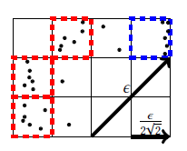

# 多核程序设计与实践-选题报告

| ID       | NAME   |
| -------- | ------ |
| 18340045 | 关雅雯 |
| 18340040 | 冯大纬 |
| 18340032 | 邓俊锋 |

## 1. 选题介绍：DBSCAN聚类算法

​	DBSCAN(Density-Based Spatial Clustering of Applications with Noise)是一基于密度的聚类算法，能够把具有足够高密度的区域划分为簇，并可在噪声的空间数据库中发现任意形状的聚类，在许多领域（如天文学等）均被广泛应用。

### 1.1. 算法原理

​	定义某一点的$\epsilon$邻域为以该点为圆心，半径为$\epsilon$的圆。

​	由此，可将数据点分为三类：

1. 核心点：$\epsilon$邻域内含有超过MinPts数目的点。
2. 边界点：$\epsilon$邻域内点的数量小于MinPts，但是落在核心点的$\epsilon$邻域内的点。
3. 噪音点：既不是核心点也不是边界点的点。


<p align="center">
    图源：博客园
</p>
#### 1.2. 算法伪代码

​	基于以上三种点的定义，我们可以将DBSCAN的算法流程伪代码简化如下：

```python
function DBSCAN (points):
    begin
        for point in points:
            初始化点的类型为核心点、边界点或噪声点
        删除噪声点
        for first in 核心点:
            for second in 核心点:
                if distance(first, second) < EPS:
                    为两个建立一条边
        每组连通的核心点形成一个簇
        for point in 边界点:
            将point指派到一个与之关联的核心点的簇中
    end
```

### 1.3. 算法复杂度

​	DBSCAN是一个串行算法。在最坏情况下，DBSCAN的复杂度为$O(|D|^4)$，其中$|D|$为待聚类的数据集$D$的大小。使用空间索引可以将其复杂度优化为$O(|D|log|D|)$。


## 2. 计划实现的优化算法

我们计划实现一个多核CPU和GPU共享存储的优化的DBSCAN聚类算法，将使用CUDA、OpenMP两个并行计算框架。

### 2.1. 原始DBSCAN算法的局限性

​	分析原DBSCAN算法，发现以下问题：

1. 原始DBSCAN算法中，需要对数据集中所有点进行$\epsilon$邻域搜索，涉及大量耗时的距离计算；
2. 原始DBSCAN算法为串行算法，没有完全利用CPU或GPU的处理能力；
3. 原始DBSCAN算法需要加载数据集中所有点，由于内存限制，原算法对数据的处理能力有限。

### 2.2. 优化算法的基本思路与实现思路

​	针对原始DBSCAN算法的局限性，我们计划实现一个CPU和GPU共享存储的优化的DBSCAN聚类算法。该算法的基本思路如下：

	1. 通过观察可知，相距较远的、不在同一聚类中的两个点可以分配给不同的部件存储计算。因此，将数据划分为若干个独立的部分，则各个部分可并行地进行聚类计算。当各个部分计算完成后，对各部分聚类进行合并，形成最终解；
 	2. 在对某一部分进行聚类计算时，应用基于空间的优化技巧，以避免大量耗时的距离计算。

​	因此可提出实现思路：

- 我们将在多核CPU上运行修改的DBSCAN算法，基于OpenMP框架，并行地对各部分进行聚类计算；
- 对某一部分的具体聚类流程如下：
  - 创建空间索引，便于搜索邻域
  - 进行避免大量耗时的距离计算的优化操作
  - 基于CUDA框架，利用GPU并行计算$\epsilon$邻域可达点，以进行聚类操作
  - 将该部分的聚类结果合并到总聚类结果中

### 2.3. 避免大量耗时的距离计算的优化操作

​	下面简要地介绍避免大量耗时的距离计算的优化操作，具体细节将在之后的实现与报告中给出：

- Dense Boxes

  建立$\frac{ϵ}{2 \sqrt2} × \frac{ϵ}{2 \sqrt2}$的网格（Dense Boxes），由几何数学易知，在同一个网格必在一个簇里。用这个方式可以避免距离太近点之间无用的距离计算。

  

- HYBRID DBSCAN

  建立$ϵ × ϵ$的网格，在计算当前点与其他点的距离时，我们只需要计算附近9个格子的点，因为再远的点与当前点的距离一定超过 ϵ ，不需要计算。

- 簇间合并

  1. 邻近的Dense Boxes的点也必在一个簇里，直接合并
  2. 隔着格子的Dense Boxes有可能要合并，需要计算判断

### 2.4. 基于CUDA并行计算$\epsilon$邻域可达点

​	去前所属，对于每个部分，我们将基于CUDA框架，利用GPU并行计算$\epsilon$邻域可达点，以进行聚类操作。

#### 空间索引

​	我们将使用基于网格的、每个单元以$\epsilon$为边长的空间索引，因此在$\epsilon$邻域搜索中，在$\epsilon$邻域中的点必然在相邻网格单元中。由于只有非空的网格会被存储，这种索引结构的空间复杂度为$O(D)$，从而节省出更多的显存。

#### 批处理

​	由于需要处理的数据集可能很大，我们将数据集进行采样，通过估计总结果集的大小来确定要执行的批数，从而进行合理的分批计算。

我们将使用若干个CUDA streams来传输、计算数据，结果会被异步传输回内存。

#### CUDA并行化的必要性

​	总结来说，基于CUDA并行计算$\epsilon$邻域可达点可将DBSCAN算法中最耗时的$\epsilon$邻域搜索并行化，结合OpenMP并行处理多个部分，可以使算法的效率大大提升。


## 参考论文

Gowanlock, Michael, et al. "Clustering throughput optimization on the GPU." *2017 IEEE International Parallel and Distributed Processing Symposium (IPDPS)*. IEEE, 2017.

Gowanlock, Michael, et al. "A Hybrid Approach for Optimizing Parallel Clustering Throughput using the GPU." *IEEE Transactions on Parallel and Distributed Systems* 30.4 (2018): 766-777.

Gowanlock, Michael. "Hybrid CPU/GPU clustering in shared memory on the billion point scale." *Proceedings of the ACM International Conference on Supercomputing*. 2019.